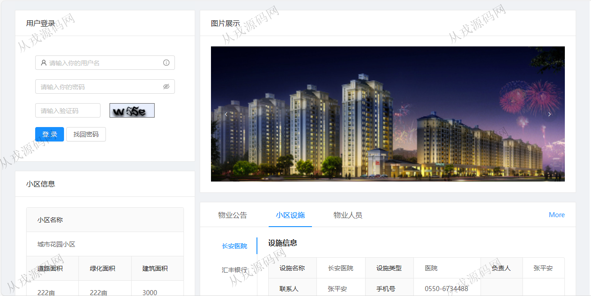
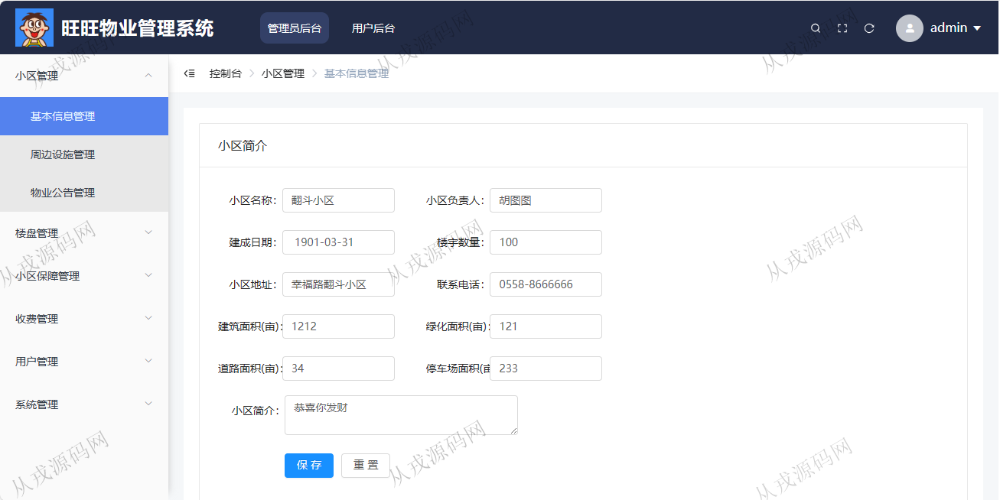
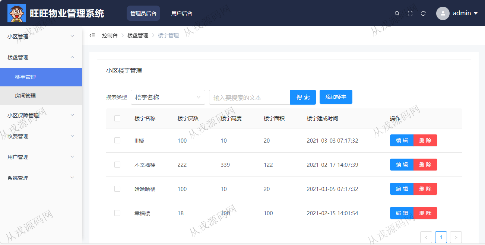
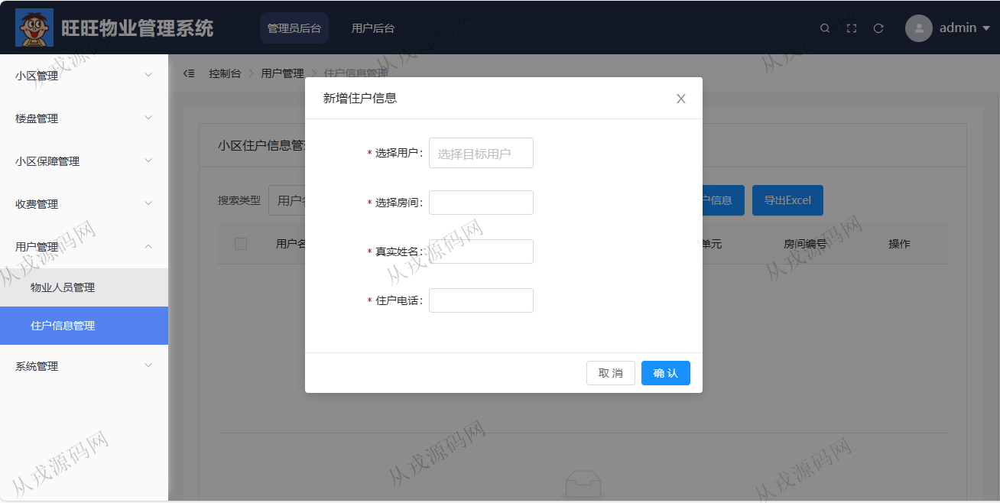
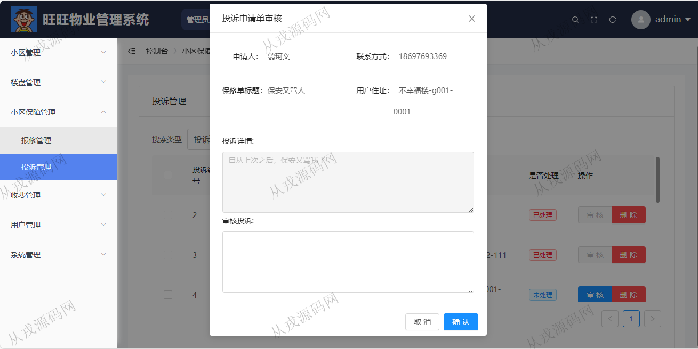
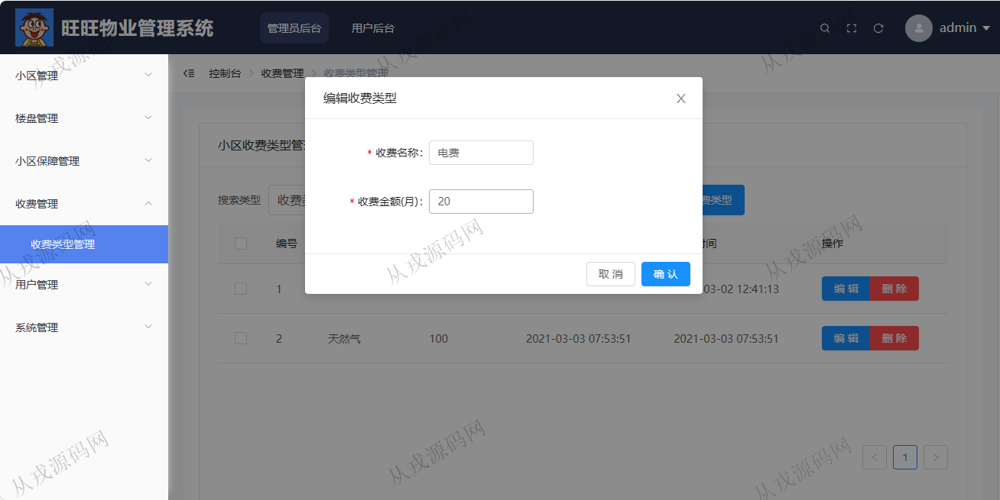
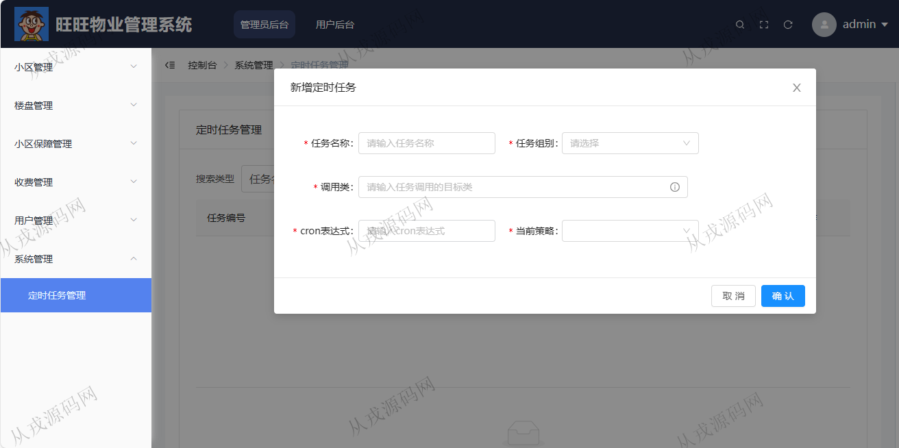

<h1 align="center">129.旺旺物业管理系统</h1>

- <b>完整代码获取地址：从戎源码网 ([https://armycodes.com/](https://armycodes.com/))</b>
- <b>技术探讨、资料分享，请加QQ群：692619798</b> 
- <b>作者微信：19941326836  QQ：952045282</b> 
- <b>承接计算机毕业设计、Java毕业设计、Python毕业设计、深度学习、机器学习</b>
- <b>选题+开题报告+任务书+程序定制+安装调试+论文+答辩ppt 一条龙服务</b>
- <b>所有选题地址 ([https://github.com/YuLin-Coder/AllProjectCatalog](https://github.com/YuLin-Coder/AllProjectCatalog)) </b>

## 项目介绍
基于springboot+vue的物业管理系统：前端 vue、elementui，后端 maven、springmvc、spring、mybatis，角色分为管理员；集成小区管理、楼盘管理、保障管理等功能于一体的系统。

## 功能介绍

- 小区管理：小区基本信息查询与修改，周边设施增删改查，物业公告信息增删改查，支持模糊查询
- 楼宇管理：小区楼宇信息增删改查
- 房间管理：房间信息的增删改查，导出excel
- 报修管理：报修信息列表查询，删除，审核
- 投诉管理：投诉信息列表查询，删除，审核
- 收费类型管理：收费类型信息的增删改查，关键词搜索
- 用户管理：物业人员信息的增删改查，住户信息的增删改查
- 定时任务管理：定时任务执行特定任务或数据处理任务

## 环境

- <b>IntelliJ IDEA 2021.3</b>

- <b>Mysql 5.7.26</b>

- <b>Node 14.14.0</b>

- <b>JDK 1.8</b>

## 运行截图

